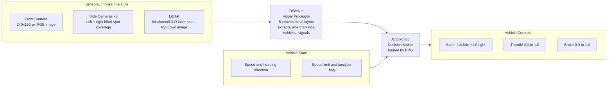
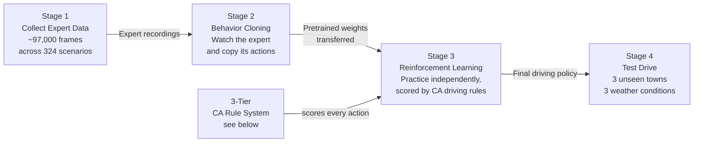
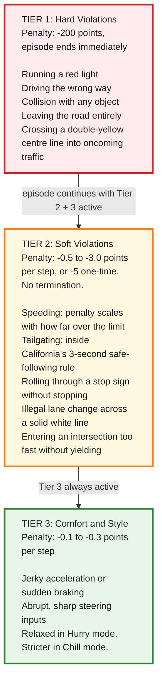

# DriveNet: Teaching a Car to Drive in Simulation

[](https://github.com/joshlaubach/drivenet-carla-av/actions/workflows/ci.yml)

---

## Table of Contents

- [What Is This?](#what-is-this)
- [In Action](#in-action)
- [How the Car Sees the World](#how-the-car-sees-the-world)
- [How the Car Learns to Drive](#how-the-car-learns-to-drive)
- [The Rules of the Road](#the-rules-of-the-road)
- [Driving Personalities](#driving-personalities)
- [What the Car Learned](#what-the-car-learned)
- [What's Next: Road to Real Deployment](#whats-next-road-to-real-deployment)
- [For Engineers](#for-engineers)

---

## What Is This?

Testing a self-driving car on real roads is expensive, dangerous, and slow. So companies like **Waymo** (Alphabet's self-driving division) and **Tesla** train their vehicles in simulation first, where crashes cost nothing and a year's worth of driving experience can be compressed into a weekend.

**DriveNet** does exactly that. It trains a virtual car to drive through a realistic city simulator called [CARLA](https://carla.org/), following real **California traffic laws**, across hundreds of different conditions: clear days, rainy nights, busy intersections, and quiet suburbs.

The car learns in two phases. First it **watches** thousands of expert driving examples and copies the patterns, like a student in a driving school. Then it **practices on its own**, earning points for good decisions and losing points for bad ones. Over time it figures out that stopping at red lights, checking mirrors before changing lanes, and keeping a safe following distance are the strategies that pay off. After training, it's tested on towns and weather it's never seen before to check whether it actually learned to drive or just memorized the practice routes.

---

## In Action

> *CARLA simulation footage will be added here after the training run completes.*

---

## How the Car Sees the World

The virtual car can use one of three sensor setups, matching the general approaches used by real autonomous vehicles today.



**What each sensor does:**

- **Front Camera:** A single forward-facing RGB camera, like a dashcam. A neural network (the car's visual brain) learns to pull meaning from the raw pixels: where the lane markings are, whether a light is red, how far ahead the next car is. This is the simplest and cheapest setup to run.

- **Side Cameras x2:** Three cameras covering front and both sides together. This is how **Tesla Autopilot** eliminates blind spots without any moving parts. All three image streams are processed by the same neural network and combined before the car decides what to do.

- **LiDAR:** A rotating laser scanner that measures the exact distance to every object within 50 meters, producing a precise 3-D map of the surroundings. The system converts that into a top-down "bird's eye view" image. **Waymo** is known for relying on LiDAR because it works well in the dark and in rain, where cameras struggle.

On top of the sensor images, the car also gets a small **vehicle state** packet each step: its current speed, the direction it's pointing, the local speed limit, and whether it's near an intersection. Think of it as a digital instrument cluster feeding data straight into the brain.

---

## How the Car Learns to Drive



### Stage 1: Collect Expert Data

A rule-based autopilot built into CARLA drives through **324 different scenarios**, covering every combination of 6 weather presets, 6 towns, 3 times of day, and 3 traffic densities. We record what it sees and what controls it applies at 20 frames per second, capturing about 97,000 snapshots of solid driving.

### Stage 2: Behavior Cloning (Watch and Copy)

This is the classroom phase. The neural network, **DriveNet**, studies all 97,000 recorded frames and learns to predict the right steering, throttle, and brake for any given camera image. It improves by comparing its guess to what the expert actually did, then nudging its internal settings to close the gap.

The catch: it can only copy what it's seen. A sudden detour or an unexpected construction zone can throw it off. That's what Stage 3 fixes.

### Stage 3: Reinforcement Learning (Practice and Improve)

Now the car drives on its own. After every action, it gets a **reward score**: positive for good behavior, negative for violations. It doesn't know the rules upfront. It finds them through trial and error, gradually figuring out that the habits earning the most points are the ones humans recognize as safe driving.

The technique is called **Proximal Policy Optimization, or PPO**. It's a type of reinforcement learning where the car updates its strategy in small, stable steps rather than wild overhauls, similar to how a new driver builds confidence one small improvement at a time rather than completely rethinking their approach after every mistake.

Training starts on clear, simple roads before expanding to rain, night driving, and complex intersections. It's the same idea as starting a student driver in an empty parking lot before taking them onto the freeway.

### Stage 4: Test Drive (Evaluation)

The final policy gets tested on **three towns it has never seen**, across three different weather conditions. We measure how much of a planned route the car completes, how often it collides, how well it keeps to its lane, and its average speed. Statistical tests confirm whether differences between models are meaningful or just noise.

---

## The Rules of the Road

Every action the car takes is scored by a **three-tier California DMV rule system** ([source](https://www.dmv.ca.gov/portal/handbook/california-driver-handbook/laws-and-rules-of-the-road/)). Instead of hand-coding specific driving behaviors, we encode real traffic law into the scoring and let the car work out how to comply.



**Why three tiers?**

Real traffic law draws a clear line between violations that endanger lives and ones that are just bad habits. Running a red light gets you pulled over on the spot. Following too closely gets you a warning. The three tiers work the same way. The car learns that Tier 1 situations are catastrophic and worth almost any cost to avoid, while Tier 2 and 3 involve real trade-offs it has to figure out on its own. Driving faster earns a speed bonus, but it also triggers a speeding penalty. What's the right balance? The car has to find out.

---

## Driving Personalities

One model, three personalities. The same neural network gets trained with different **reward weightings** to produce three distinct driving styles. All three start from the same Stage 2 weights. Only the PPO scoring changes.

| Style | Behavior | Speed Priority | Smoothness | Lane Discipline |
|-------|----------|---------------|------------|-----------------|
| **Chill** | Relaxed and unhurried. Brakes early, never rushes. | Low | Very high | Strict, rarely changes lanes |
| **Standard** | Balanced between comfort and efficiency. | Medium | Medium | Moderate |
| **Hurry** | Assertive and fast. Pushes closer to the speed limit. | High | Relaxed | Flexible, accepts more lane changes |

The chill style penalizes sudden acceleration changes and abrupt steering twice as heavily as standard. The hurry style relaxes those penalties and instead pushes hard for speed. The result is three genuinely different drivers from the same architecture, not just different speedometers.

---

## What the Car Learned

Full quantitative benchmarks are still running. Here's a qualitative read on each model after training.

### BC Baseline: "Competent Student"

After studying the expert recordings, the base model reliably keeps its lane and respects speed limits in clear daytime conditions. It handles straightaways and gentle curves without trouble. Complex intersections trip it up, since it rarely saw enough examples of them in training. Night driving is noticeably weaker than daytime. That's a predictable limitation of copying an expert: if the training footage skews toward good conditions, performance drops when conditions change.

### PPO Chill: "Sunday Driver"

The chill agent drives deliberately and smoothly. It brakes early, never tailgates, and stays in its lane even when a faster one is open. Slower than the other styles on average, but the most comfortable passenger experience, with gentle acceleration and gradual steering inputs. In bad weather, its caution pays off with fewer hard violations than the hurry style.

### PPO Standard: "Everyday Commuter"

The standard agent finds the best overall balance. It stops at red lights and stop signs consistently, keeps safe distances in traffic, and completes the highest share of planned routes across all three evaluation towns. When rain or darkness makes conditions worse, it backs off the accelerator rather than pushing through. The most reliable policy across the board.

### PPO Hurry: "Late for a Meeting"

The hurry agent drives confidently and fast, staying close to the speed limit wherever it can. It makes bolder lane choices and accepts slightly abrupt moves to keep up pace. It excels on clear roads but picks up more speeding violations in the rain, where its speed-rewarding instincts work against it. It still avoids hard violations consistently. Assertive, not reckless.

---

## What's Next: Road to Real Deployment

DriveNet is simulation-only today. The gap between a CARLA city and real San Francisco streets involves a handful of genuinely hard problems that teams at Waymo, Cruise, and others are actively working through:

- **Sensor noise and imperfection.** Real cameras deal with lens flare, rain on the glass, and compression artifacts. Real LiDAR returns shift with surface reflectivity. Simulation sensors are perfect by comparison. Closing this gap, called **sim-to-real transfer**, means either making simulation messier during training or fine-tuning the model on real-world data.

- **Edge cases the simulator never shows.** A ball rolling into the street, a cop directing traffic by hand, a construction zone with taped-off lanes. CARLA has none of these. The car has no concept of them.

- **Predicting what other drivers will do.** Right now the car reacts to vehicles around it but doesn't predict their next move. Real AV systems build a model of every nearby road user's likely intentions and plan for all of them at once.

- **Hardware testing.** Before putting it in a real car, the policy would run on physical compute hardware with real sensor feeds, making sure it can make decisions fast enough for safe control.

- **Regulatory approval.** Operating an autonomous vehicle on California public roads requires a DMV permit, documented safety cases, and regular disengagement reports. Simulation results feed into that process but don't replace it.

The clearest next steps: fine-tune on real dashcam footage to close the visual gap, add awareness of pedestrians and cyclists, and get onto a closed track with a real vehicle.

---

## For Engineers

### Prerequisites

- Windows 11 with an NVIDIA GPU (tested on RTX 5080, 32 GB system RAM)
- CARLA 0.9.16 installed at `CARLA_0.9.16/`
- Python 3.11 with CUDA 12.8

### Installation

```bash
pip install -r requirements.lock.txt  # exact pinned versions (recommended)
# or
pip install -r requirements.txt       # loose version manifest
```

For Linux CI or non-CARLA work, use `requirements-ci.txt`, which drops the `carla` package (Windows-only wheel).

### Running Tests

```bash
python -m pytest tests/ -v
python -m pytest tests/test_config_loading.py -v
python -m pytest tests/test_config_loading.py::test_ppo_reward_profiles -v
```

CARLA connectivity tests auto-skip when no server is running on `localhost:2000`.

### Linting

```bash
ruff check src/ tests/
```

### Notebook Pipeline

| Notebook | Description | CARLA Required |
|----------|-------------|----------------|
| `01_data_collection.ipynb` | Expert data collection across 324 ODD conditions | Yes, subprocess-per-town |
| `02_behavior_cloning.ipynb` | Train BC_model (DriveNet imitation learning) | No |
| `03_ppo_finetuning.ipynb` | PPO fine-tuning with driving styles and curriculum | Yes, subprocess-per-town |
| `04_evaluation.ipynb` | Multi-scenario benchmarking + violation analysis | Yes, manual restart between towns |
| `05_causal_analysis.ipynb` | Propensity score matching causal inference | No |

Each notebook is a thin shell around a WAT agent in `src/agents/`. The agents do all real work.

### Model: Inputs, Outputs, and Training Objectives

**State vector** (6-dimensional, concatenated with visual features before the MLP heads):

$$\mathbf{s} = \left[\frac{v}{60},\ \sin\theta,\ \cos\theta,\ \frac{v_\text{lim}}{130},\ \frac{n_\text{lanes}}{4},\ \mathbb{1}_\text{junction}\right] \in \mathbb{R}^6$$

**Action squashing** (raw MLP outputs $z$ are squashed to bounded control ranges):

$$a_\text{steer} = \tanh(z_0) \in [-1,1], \qquad a_\text{throttle} = \sigma(z_1) \in [0,1], \qquad a_\text{brake} = \sigma(z_2) \in [0,1]$$

**Behavior Cloning loss** (brake upweighted 5x as the safety-critical output):

$$\mathcal{L}_\text{BC} = \mathcal{L}(a_\text{steer}) + \mathcal{L}(a_\text{throttle}) + 5\cdot\mathcal{L}(a_\text{brake})$$

**PPO clipped surrogate objective:**

$$\mathcal{L}^\text{CLIP}(\theta) = \mathbb{E}_t\!\left[\min\!\left(r_t(\theta)\,\hat{A}_t,\ \text{clip}\!\left(r_t(\theta),\,1-\varepsilon,\,1+\varepsilon\right)\hat{A}_t\right)\right]$$

where $r_t(\theta) = \dfrac{\pi_\theta(a_t \mid s_t)}{\pi_{\theta_\text{old}}(a_t \mid s_t)}$ and $\varepsilon = 0.2$.

**Generalized Advantage Estimation** ($\lambda = 0.95$, $\gamma = 0.99$):

$$\hat{A}_t = \sum_{l=0}^{T-t}(\gamma\lambda)^l\,\delta_{t+l}, \qquad \delta_t = r_t + \gamma\,V(s_{t+1}) - V(s_t)$$

**Style embedding**: a learned lookup table $E \in \mathbb{R}^{3 \times 4}$ maps each style token $k \in \{0,1,2\}$ to a 4-dimensional vector concatenated with $\mathbf{s}$ and visual features before both actor and critic heads. BC backbone weights transfer to PPO; only the heads are freshly initialized because the PPO head drops metadata embeddings and adds the style vector.

### Reward Pipeline

All three layers apply every step in this order.

**Layer 1: `CarlaEnv.step()`:**

$$r_1 = +1.0 - 3.0\cdot\mathbb{1}_\text{lane invasion} - 200\cdot\mathbb{1}_\text{collision}$$

Collision also sets `terminated = True`.

**Layer 2: `RoadRuleMonitor.step()`** (Gymnasium wrapper, CA rule enforcement):

*Tier 1: episode-terminating, $-200$ each*

| Violation | Trigger condition |
|-----------|-------------------|
| Red light | $d_\text{stopline} < 12\ \text{m}$, state = Red, $v > 5\ \text{km/h}$, and $\Delta v/\Delta t > -0.3\ \text{km/h/step}$ for 3+ consecutive frames |
| Wrong-way | $\hat{\mathbf{f}}_\text{vehicle} \cdot \hat{\mathbf{f}}_\text{road} < -0.7$ outside junctions for 30+ frames |
| Off-road | Waypoint query returns a non-driving lane type for 10+ frames |
| Double-solid crossing | `LaneMarkingType.SolidSolid` present in crossed lane markings |

*Tier 2: per-step or one-time penalties, no termination*

Speeding, scaling linearly with excess fraction:

$$p_\text{speed} = -3.0\cdot\frac{\max(v - v_\text{lim},\,0)}{v_\text{lim}}$$

Tailgating, linear inside the California 3-second following envelope (CVC 21703):

$$p_\text{tailgate} = -\!\left(1 - \frac{d_\text{lead}}{d_\text{safe}}\right)\cdot\mathbb{1}[d_\text{lead} < d_\text{safe}], \qquad d_\text{safe} = \max\!\left(\frac{v}{3.6}\cdot 3.0,\ 5.0\right)\ \text{m}$$

Stop sign (CVC 22450): $-5$ one-time on zone exit without a full stop ($v < 3\ \text{km/h}$ inside the 15 m zone). 8-second cooldown per sign resets the state machine.

Solid lane crossing (CVC 21658): $-7$ additive on top of Layer 1's $-3$ baseline. A double-solid crossing escalates to Tier 1 instead.

Failure to yield (CVC 21800): $-1.5$ one-time on entering an uncontrolled junction above $10\ \text{km/h}$.

Every violation is reported in `info["road_rule_monitor"]` each step.

**Layer 3: `compute_style_reward()`** (Tier 3 comfort shaping, applied in `PPOAgent._collect_rollout()`):

$$r_\text{shaped} = r_\text{base} + w_v\cdot\frac{v}{40} - w_J\cdot\frac{J}{1000} - w_\delta\cdot\frac{|\dot{\delta}|}{10} - w_\ell\cdot\mathbb{1}[\text{lane change}]$$

where $J = \dfrac{|\dot{v}_t - \dot{v}_{t-1}|}{\Delta t}$ is jerk and $|\dot{\delta}|$ is steering rate. Weights come from `configs/ppo.yaml`:

| Style | $w_v$ | $w_J$ | $w_\delta$ | $w_\ell$ |
|-------|-------|-------|-----------|---------|
| Chill | 0.5 | 2.0 | 2.0 | 2.0 |
| Standard | 1.0 | 1.0 | 1.0 | 1.0 |
| Hurry | 2.0 | 0.5 | 0.3 | 0.5 |

### Configuration

All hyperparameters live in `configs/*.yaml`. Load them with `src.config.load_config(name)`. A value changed in YAML propagates automatically to both the agent and its notebook. Don't hard-code hyperparameters in Python.

### CARLA Launch Reference

Always use `-dx12` on RTX 5080 Blackwell. Kill the CARLA process between towns. In-place map switching after a sensor cycle aborts on this GPU.

```bash
scripts/launch_carla.bat
CARLA_0.9.16/CarlaUE4.exe -dx12 -quality-level=Low
```

### Reproducibility

| Component | Version |
|-----------|---------|
| Python | 3.11.x |
| CUDA | 12.8 |
| PyTorch | 2.3.1 |
| CARLA | 0.9.16 |
| OS | Windows 11 |

All agents seed `torch`, `numpy`, and `random` from the `seed` field in the relevant config (default `42`). CUDNN determinism is off; the multi-hour training loops make the runtime penalty impractical. CARLA's traffic spawning uses its own internal RNG that can't be seeded from client code, so small run-to-run variation is expected.

### Known Limitations

- Expert data comes from CARLA's autopilot, which struggles at unprotected left turns and in dense traffic. The BC baseline inherits those gaps.
- 3 episodes per evaluation condition gives wide collision-rate confidence intervals. 20+ would be needed for tight bounds.
- Single training seed per town/style combination.
- BatchNorm is frozen during PPO fine-tuning to prevent running-stats drift on small, correlated minibatches. GroupNorm would be cleaner long-term.
- Windows-only developer environment; code is Linux-portable but untested there.
